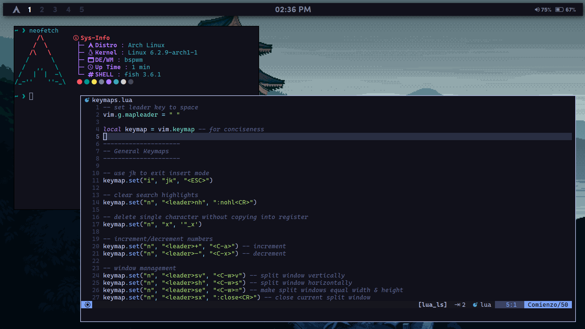

# Dotfiles! ☕
Welcome to my dotfiles for Arch Linux, BSPWM, and Polybar! This repository contains my personal configuration files and scripts.
### About:
* **Alacritty** as the terminal. ⌨️
* **Tokyo Night** as the color scheme. 🌃
* **BSPWM** as the window manager. 🪟
* **Picom** as the compositor. ✨
* **Rofi** as the application launcher. 🚀
* **SDDM** as the Display Manager. 🖥️
* **Dunst** as the notification daemon. 📢
* **Polybar** as the main bar. 📊
* **LunarVim** as the code editor. ✏️

## Installation:
<details>
<summary>🔧 <b>Install Dependencies:</b></summary>

```bash
yay -S polybar rofi bspwm-rounded-corners-git xdg-user-dirs nautilus xorg pavucontrol blueberry xfce4-power-manager feh lxappearance papirus-icon-theme file-roller gtk-engines gtk-engine-murrine neofetch imagemagick parcellite xclip maim gpick curl jq tint2 zsh moreutils recode dunst python-xdg redshift mate-polkit xfce4-settings mpv fish alsa-utils sddm xorg-xinit brightnessctl acpi mugshot playerctl python-pytz glava wmctrl inter-font bsp-layout zscroll noise-suppression-for-voice starship system76-power lsof xdo bluez bluez-utils bluez-libs bluez-tools firefox
```

#### 2. Animations
Picom Pijulius Fork has the best window animations you can get. 

First install all the dependencies required to build the compositor:
```bash
sudo pacman -S libconfig libev libxdg-basedir pcre pixman xcb-util-image xcb-util-renderutil hicolor-icon-theme libglvnd libx11 libxcb libxext libdbus asciidoc uthash
```
Then do the following:
```bash
cd ~/Downloads
git clone https://github.com/pijulius/picom.git
cd picom/
meson --buildtype=release . build --prefix=/usr -Dwith_docs=true
sudo ninja -C build install
```

Add your user to the ADM Group and start the following services:
```bash
sudo usermod -aG adm $USER
```

Start the system76-power service:
```bash
sudo systemctl enable --now com.system76.PowerDaemon
```

Bluetooth:
```bash
sudo systemctl enable bluetooth
```

</details>
<details>
<summary>🖌️ <b>Installing GTK Theme:</b></summary>
<a href="https://github.com/Fausto-Korpsvart/Tokyo-Night-GTK-Theme">Tokyo Night GTK Theme</a>

```bash
cd ~/Downloads
git clone https://github.com/Fausto-Korpsvart/Tokyo-Night-GTK-Theme.git
cd Tokyo-Night-GTK-Theme/
mv themes/Tokyonight-Dark-BL /usr/share/themes/
```
</details>
<details>
<summary>💻 <b>Installing Dotfiles:</b></summary>

Clone them and install:
```bash
cd ~/Downloads
git clone https://github.com/cr1st1anhernandez/dotfiles
cd hotfiles
cp -r .config .scripts .local .wallpapers ~/
cp .xinitrc .gtkrc-2.0

 ~/
```
Install Fonts:
```bash
cd .fonts
mv * /usr/share/fonts
```

Move `environment` to its location:
Assuming you are in the `hotfiles` folder:
```bash
cd etc/
mv environment /etc/
```
Copy `usr`:
```bash
sudo cp -r usr/* /usr/
```

</details>

#### Additional features:

<details>
<summary>🎵 <b>Spicetify Theme:</b></summary>

Let's add a theme to our Spotify!
Install Spotify:
```bash
yay -S spotify
```

Install Spicetify using:
```bash
yay -S spicetify-cli-git
```
Then give it the necessary permissions:
```bash
sudo chmod a+wr /opt/spotify
sudo chmod a+wr /opt/spotify/Apps -R
```

After that, run:

```bash
spicetify config current_theme Ziro
spicetify config color_scheme tokyonight
spicetify config extensions adblock.js
spicetify backup apply
```
This will install the Spicetify theme to your Spotify.

</details>

<details>
<summary>🖱️ <b>Enable Touchpad Tap-to-click:</b></summary>

If you are a laptop user, you might want to enable tap to click to make it easier to navigate using a touchpad.

```bash
sudo mkdir -p /etc/X11/xorg.conf.d && sudo tee <<'EOF' /etc/X11/xorg.conf.d/90-touchpad.conf 1> /dev/null
Section "InputClass"
        Identifier "touchpad"
        MatchIsTouchpad "on"
        Driver "libinput"
        Option "Tapping" "on"
EndSection

EOF
```
</details>

<details>
<summary>📂 <b>Get your directories:</b></summary>

If there are no default directories when you do `dir` or `ls`, you might just have to manually create them.
Just install `xdg-user-dirs` and run the command, then reboot.
```bash
xdg-user-dirs-update
```
</details>


## Desktop:



## Credits:

#### Thanks to:
* [Syndrizzle](https://github.com/Syndrizzle/hotfiles)
* [rxyhn](https://github.com/rxyhn)
* [pagankeymaster](https://github.com/pagankeymaster)
* [beyond9thousand](https://github.com/beyond9thousand)
* [siduck](https://github.com/siduck)
* [kizu](https://github.com/janleigh)
* All the members of r/unixporn community and the discord server!
* **Most of the configurations are inspired by the configuration of [Syndrizzle](https://github.com/Syndrizzle/hotfiles)** 💡
* **The wallpapers have been taken from [Wallhaven](https://wallhaven.cc), [pexels](https://pexels.com), and the [Tokyo Night GTK Theme](https://github.com/Fausto-Korpsvart/Tokyo-Night-GTK-Theme/tree/master/wallpapers) repository** 🌄
* **The icons are from [icons8](https://icons8.com), [flaticon](https://flaticon.com), [materialdesignicons](https://materialdesignicons.com), [IcoMoon](

https://icomoon.io), [feather-icons](https://feathericons.com/), and [Nerd Fonts](https://www.nerdfonts.com)** 🎨
* The Conky theme was taken from [closebox73's Scorpio](https://github.com/closebox73/Scorpio) conky themes pack, named "Auva". It was modified to match the color scheme. 🌟

Feel free to explore and customize these dotfiles to make them your own! Enjoy! 🎉
